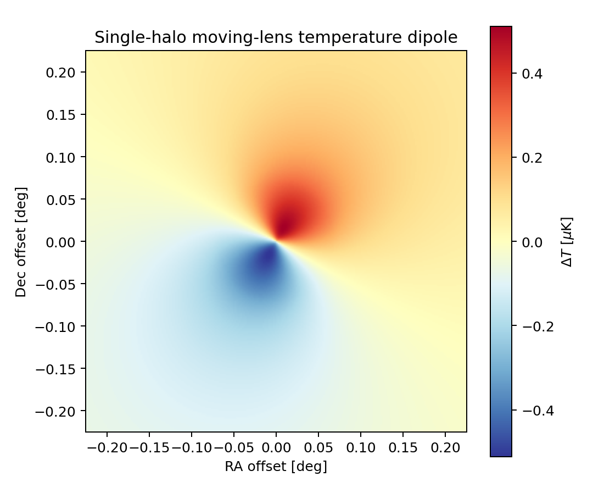
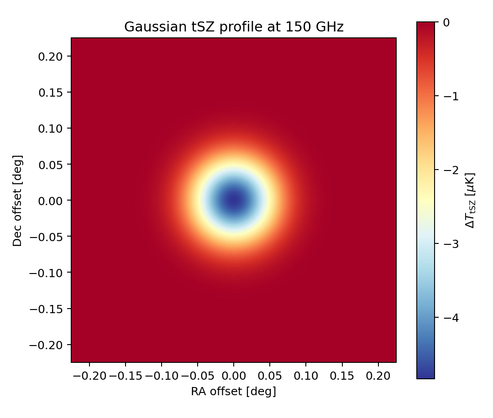
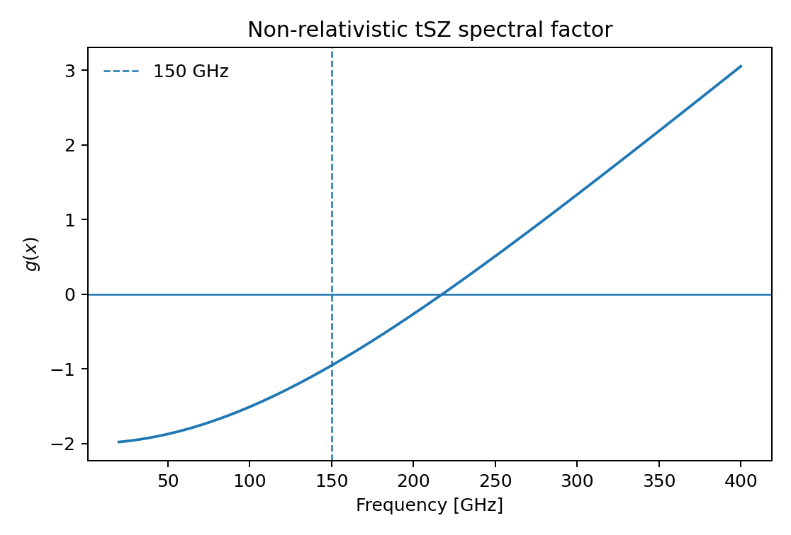
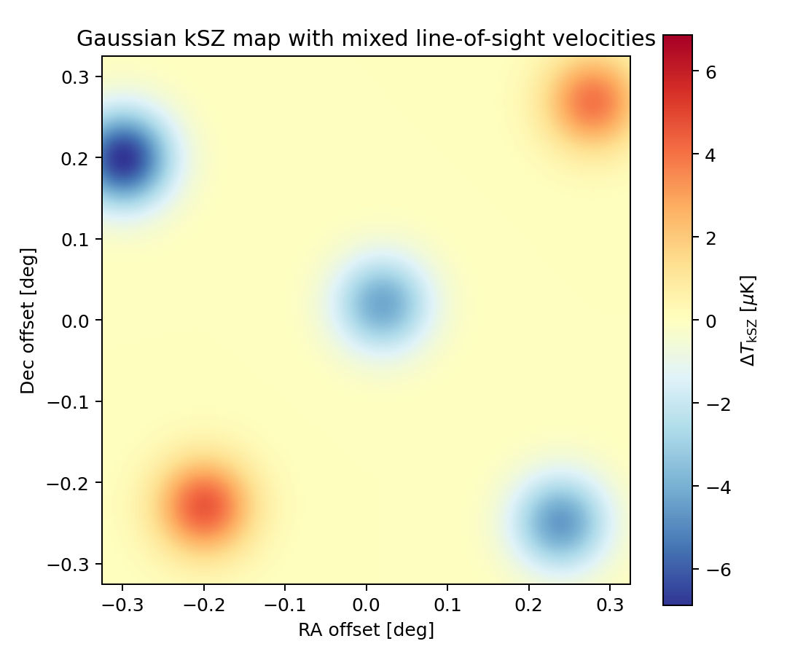
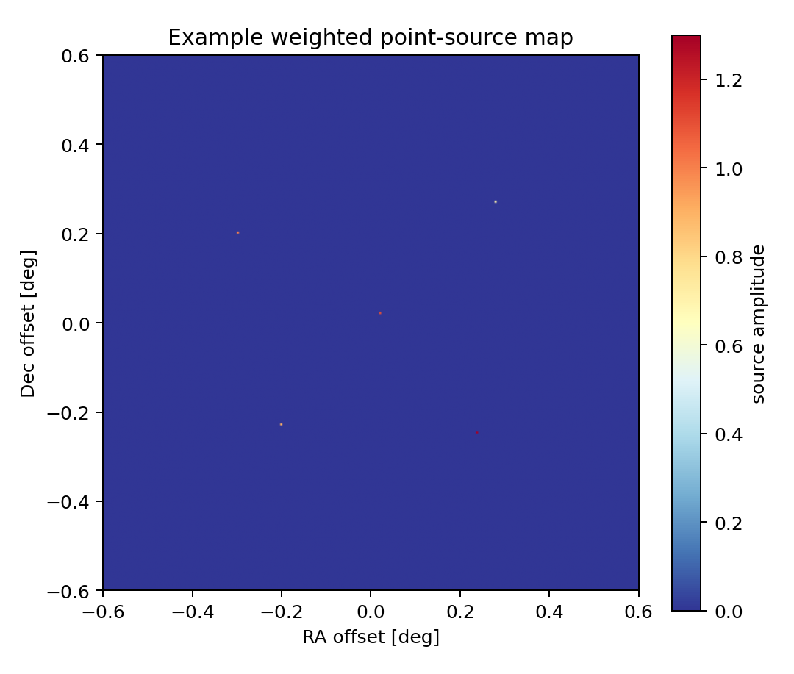
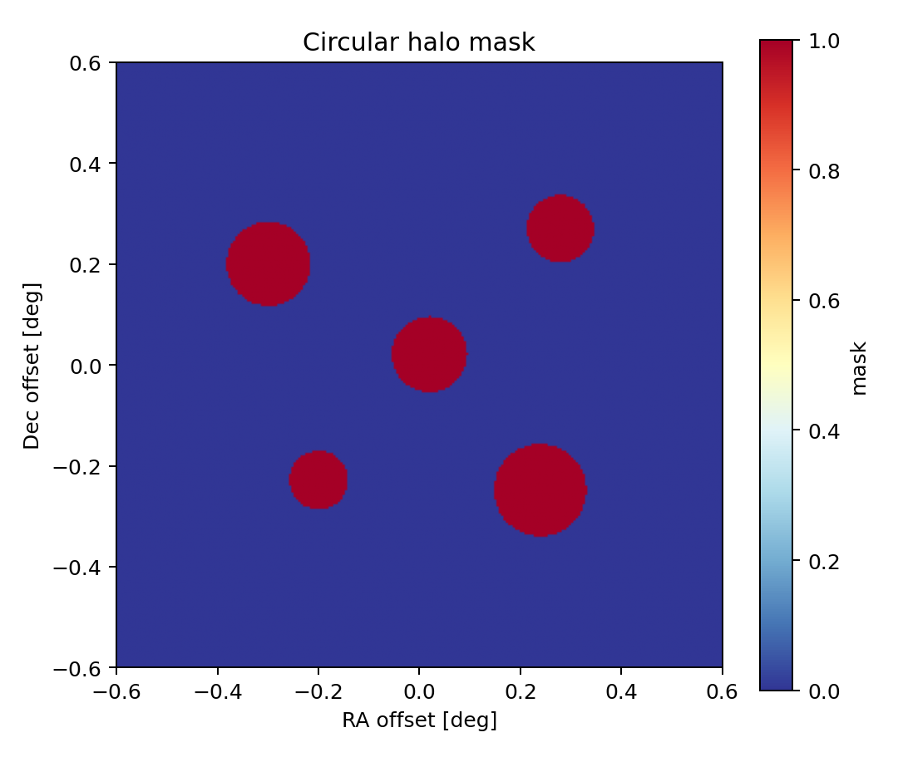

# Flat-Sky Signal Painter

Python tools for painting compact astrophysical signals onto flat-sky maps from object catalogs.

The package includes moving-lens temperature dipoles, Gaussian thermal-SZ and kinetic-SZ profiles, point/impulse source layers, and circular halo masks in a common configurable map geometry.

**Tech:** Python · NumPy · pandas · Matplotlib · tqdm · pytest

<p align="center">
  
</p>

<p align="center"><em>Multiple halos evolve over time as their transverse velocities rotate and their sky positions drift.</em></p>

## Included signal painters

| Component | Model |
|---|---|
| **Moving lens** | truncated-NFW deflection profile × transverse velocity |
| **thermal SZ** | Gaussian temperature profile with configurable observing frequency |
| **kinetic SZ** | Gaussian optical-depth profile × line-of-sight peculiar velocity |
| **Point sources** | nearest-pixel catalog source painter with optional amplitudes |
| **Dust/CIB test layer** | compact catalog-position temperature impulses |
| **Localization disks** | small unit disks around catalog positions |
| **Halo masks** | per-object circular masks with catalog-supplied angular radii |

The dust/CIB routine is intentionally a compact source-position test layer rather than a full spectral-energy-distribution model.

## Moving-lens model

For transverse speed $v_\perp$,

```math
\Delta T =
T_{\rm CMB}\,
\beta(\theta)\,
\frac{v_\perp}{c}
\cos(\phi_v-\phi),
```

where $\beta(\theta)$ is the truncated-NFW lensing deflection profile, $\phi_v$ is the transverse-velocity direction, and $\phi$ is the angular position around the halo.

<p align="center">
  
</p>

## Thermal SZ model

The non-relativistic thermodynamic-temperature factor is

```math
g(x)=x\coth(x/2)-4,
\qquad
x=\frac{h\nu}{k_B T_{\rm CMB}}.
```

The Gaussian painter uses

```math
\Delta T_{\rm tSZ}(\theta)
=
A\,T_{\rm CMB}\,g(x)
\exp\left(-\frac{\theta^2}{2\sigma^2}\right).
```

The default configuration uses 150 GHz, intrinsic FWHM $5.83'$, and amplitude scale 1.328.

<p align="center">
  
</p>

<p align="center">
  
</p>


## Kinetic SZ model

The kSZ painter uses the standard thermodynamic-temperature relation

```math
\frac{\Delta T_{\rm kSZ}}{T_{\rm CMB}}
=
-\tau(\theta)\frac{v_{\rm los}}{c},
```

with a Gaussian optical-depth profile,

```math
\tau(\theta)
=
\tau_0
\exp\left(-\frac{\theta^2}{2\sigma^2}\right).
```

Positive \(v_{\rm los}\) is defined as motion away from the observer.

<p align="center">
  
</p>

## Catalog layers and masks

<p align="center">
  
</p>

<p align="center">
  
</p>

## Installation

```bash
pip install -e .
```

For tests and development utilities:

```bash
pip install -e ".[dev]"
```

## Quick start

```python
import pandas as pd

from flat_sky_signal_painter import (
    MapGeometry,
    MovingLensCatalog,
    paint_moving_lens,
    paint_tsz_gaussian,
    paint_ksz_gaussian,
)

df = pd.read_csv("examples/demo_catalog.csv")
geometry = MapGeometry(npix=256, size_deg=1.2)

ml_catalog = MovingLensCatalog.from_dataframe(df)
ml_map = paint_moving_lens(ml_catalog, geometry)

tsz_map = paint_tsz_gaussian(
    df["RArad"],
    df["DECrad"],
    df["tszGaussAmp"],
    geometry,
    frequency_ghz=150.0,
)

ksz_map = paint_ksz_gaussian(
    df["RArad"],
    df["DECrad"],
    df["kszTauAmp"],
    df["vLos"],
    geometry,
)
```

## Command line

The package exposes a small CLI with separate painter subcommands:

```bash
sky-paint moving-lens examples/demo_catalog.csv \
  --npix 256 --size-deg 1.2 \
  --output outputs/moving_lens.npy \
  --png outputs/moving_lens.png
```

Other subcommands are:

```text
sky-paint tsz
sky-paint ksz
sky-paint points
sky-paint dust
sky-paint mask
```

## Input columns

The demo and DataFrame adapters use the same compact names as the analysis catalogs:

| Column | Meaning | Units |
|---|---|---|
| `Z` | redshift | dimensionless |
| `cNFW` | NFW concentration / truncation radius in units of $R_s$ | dimensionless |
| `Rs` | comoving NFW scale radius | Mpc |
| `rhoS` | comoving characteristic density | $M_\odot\,{\rm Mpc}^{-3}$ |
| `comovDist` | comoving distance | Mpc |
| `vTh` | transverse theta-velocity component | km/s |
| `vPh` | transverse phi-velocity component | km/s |
| `RArad` | flat-patch RA coordinate | rad |
| `DECrad` | flat-patch Dec coordinate | rad |
| `tszGaussAmp` | Gaussian tSZ profile amplitude | dimensionless |
| `kszTauAmp` | Gaussian kSZ optical-depth amplitude | dimensionless |
| `vLos` | line-of-sight peculiar velocity | km/s |
| `Thetavir` | circular mask radius | rad |
| `pointAmp` | optional point-source amplitude | arbitrary |
| `dustAmp` | optional dust-test source amplitude | µK |

`shiftedRArad` / `shiftedDECrad` are also accepted for compatibility with the analysis catalogs.

## Package layout

```text
src/flat_sky_signal_painter/
  catalog.py       # catalog adapters and validation
  geometry.py      # flat-sky grid geometry
  profiles.py      # NFW, Gaussian, and tSZ spectral profiles
  moving_lens.py   # moving-lens temperature painter
  tsz.py           # Gaussian tSZ painter
  ksz.py           # Gaussian kSZ painter
  sources.py       # point, dust-test, and localization layers
  masks.py         # circular halo masks
  cli.py           # command-line interface

examples/
  demo_catalog.csv
  make_gallery.py

figures/
  moving_lens_dipole.png
  nfw_profile.png
  tsz_gaussian.png
  ksz_gaussian.png
  tsz_spectral_factor.png
  point_sources.png
  halo_mask.png
  velocity_rotation.gif

tests/
  test_profiles.py
  test_painters.py
```

## Scientific context

The moving-lens implementation was developed for simulations associated with:

**Ali Beheshti, Emmanuel Schaan, Arthur Kosowsky,  
“Moving lens effect: Simulations, forecasts, and foreground mitigation,”  
Physical Review D 111, 043510 (2025).**

- [Published paper](https://doi.org/10.1103/PhysRevD.111.043510)
- [arXiv:2408.16055](https://arxiv.org/abs/2408.16055)
- [ThumbStack moving-lens branch](https://github.com/EmmanuelSchaan/ThumbStack/tree/moving_lens)

ThumbStack is a separate analysis framework. This repository focuses on reusable flat-sky signal-painting utilities.

